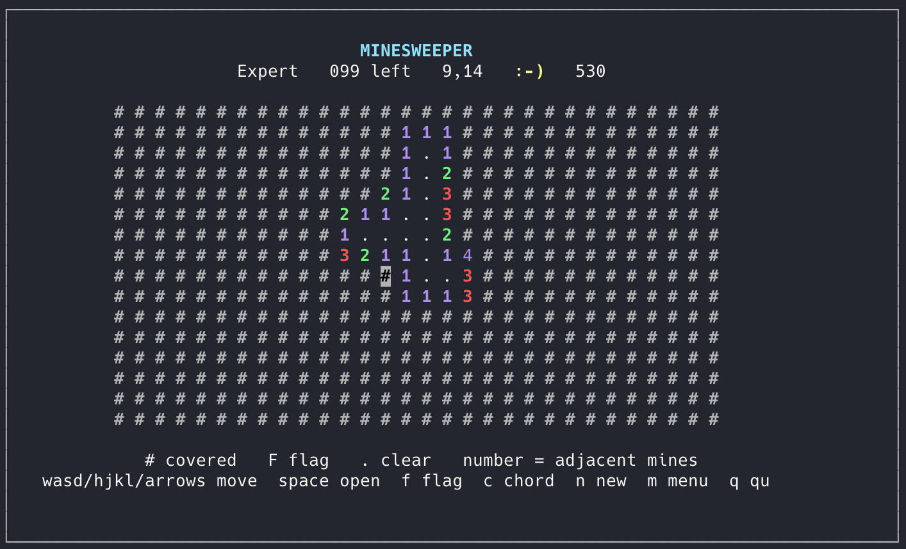

# Minesweeper

A Minesweeper game you play in the terminal. It uses only the Python standard library, so there is nothing to install with pip.



## Requirements

- Python 3.10 or newer
- macOS or Linux (the game uses `curses`, which ships with Python on those systems)

Check Python with:

```bash
python3 --version
```

On macOS, install it from [python.org](https://www.python.org/downloads/) or with Homebrew:

```bash
brew install python
```

## Install

Clone the private repository and start a game:

```bash
git clone git@github.com:filmncode/minesweeper.git
cd minesweeper
python3 minesweeper.py
```

The menu lets you pick a board:

| Board | Size | Mines |
| --- | --- | --- |
| Beginner | 9×9 | 10 |
| Intermediate | 16×16 | 40 |
| Expert | 16×30 | 99 |
| Custom | up to 24×36 | you choose |

You can also skip the menu:

```bash
python3 minesweeper.py --rows 16 --cols 30 --mines 99
```

`--seed` replays a layout. The same seed and the same first open produce the same board. A finished game prints its seed.

```bash
python3 minesweeper.py --rows 9 --cols 9 --mines 10 --seed 4
```

## How to play

The first cell you open is never a mine. When the board is not too crowded, the cells around that first open stay clear too.

| Key | Action |
| --- | --- |
| Arrow keys, wasd, or hjkl | Move |
| Space or Enter | Open a cell. On a number, this chords |
| `f` | Flag or unflag |
| `c` | Chord when the flags around a number match it |
| `n` | New game, same size |
| `m` | Back to the size menu |
| `q` | Quit |

A left click opens a cell and a right click flags it, in terminals that report mouse clicks.

`#` is covered, `F` is a flag, `.` is clear, and a number is how many mines touch that cell. The counter is mines minus flags, so extra flags push it below zero.

## Tests

```bash
python3 -m unittest test_game.py
```
